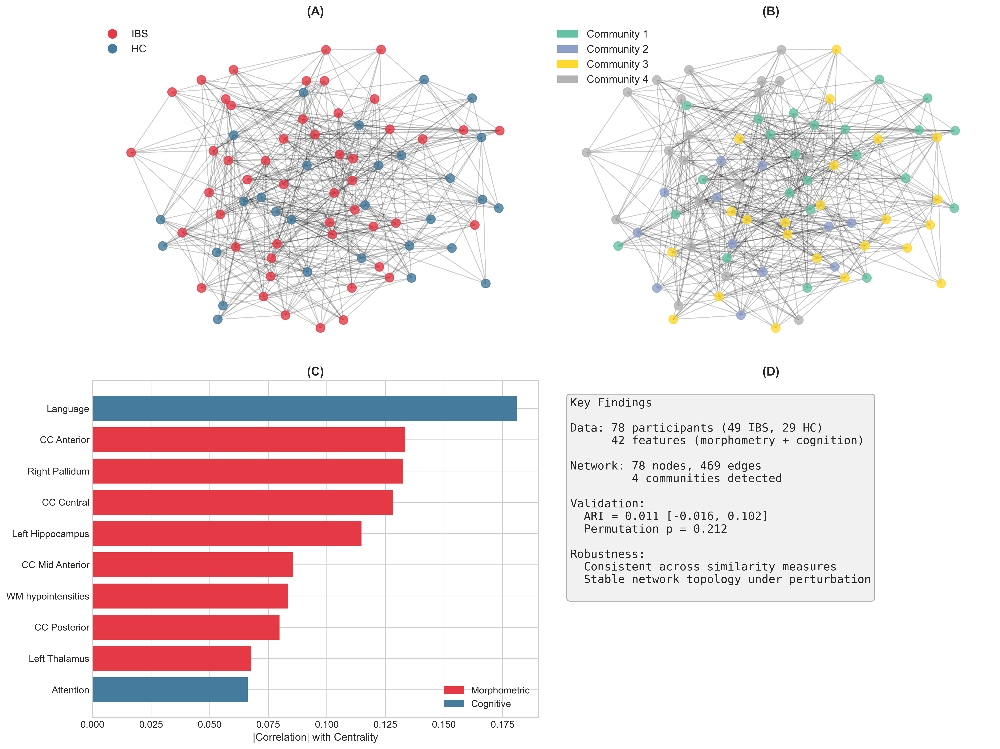

# PSN-IBS: Patient Similarity Networks for Irritable Bowel Syndrome

[](https://colab.research.google.com/github/arvidl/psn-ibs/blob/main/notebooks/patient_similarity_networks_ibs_brain_morphometry_cognition.ipynb)
[](https://opensource.org/licenses/MIT)

**Data and code accompanying:**

> *Patient Similarity Networks for Irritable Bowel Syndrome: Revisiting Brain Morphometry and Cognitive Features* <br>(to appear in *Diagnostics*)

This project applies **Patient Similarity Networks (PSN)** to investigate heterogeneity in Irritable Bowel Syndrome (IBS) using brain morphometry and cognitive measures, complementing the machine learning approach presented in [Lundervold et al. (2025)](https://doi.org/10.3390/diagnostics15040470).

---

## Overview

Irritable Bowel Syndrome (IBS) is a heterogeneous gut-brain disorder affecting ~10% of the global population. This project uses network-based analysis to:

- **Identify patient subgroups** without predefined categories
- **Discover features** driving patient similarity
- **Relate network structure** to clinical outcomes (IBS-SSS)
- **Validate findings** with bootstrap and permutation testing

### Key Features

- Combines brain morphometry (FreeSurfer v7.4.1) with cognitive assessments (RBANS)
- Multiple similarity measures (Euclidean, cosine, correlation)
- Community detection using Louvain algorithm
- Centrality and feature importance analyses
- Rigorous statistical validation

### Graphical Summary

<p align="center">
  
</p>

**Figure: Graphical summary of the Patient Similarity Network analysis.**

**(A) Network by Diagnosis.** The PSN with nodes colored by diagnostic group (IBS = red, HC = blue), showing the mixing of patients across the network. This visualization reveals that IBS patients and healthy controls do not form distinct clusters based on their brain morphometry and cognitive profiles, suggesting that diagnostic status alone does not capture the underlying neurobiological heterogeneity.

**(B) Network by Community.** The same network with nodes colored by the four detected communities, illustrating how the Louvain algorithm partitions patients based on brain-cognition similarity rather than diagnosis. Each community contains both IBS patients and healthy controls, indicating that the natural groupings emerging from brain and cognitive data cut across the traditional diagnostic boundary.

**(C) Top 10 Contributing Features.** The ten features contributing most strongly to network structure, with morphometric features (red bars, n=8) and cognitive features (blue bars, n=2) both represented. Among the top 10: corpus callosum segments (CC Anterior, CC Central, CC Posterior), subcortical structures (pallidum, thalamus, hippocampus), and two cognitive indices (**Language skills**, **Attention**). This multimodal composition highlights that patient similarity in IBS reflects both brain structural variation and cognitive function differences.

**(D) Key Quantitative Findings.**
- **Network structure**: 78 nodes (participants) connected by 469 edges based on brain-cognition similarity
- **Community detection**: Adjusted Rand Index (ARI) = 0.011 with 95% confidence interval spanning zero, indicating communities do not correspond to IBS/HC diagnosis
- **Statistical validation**: Permutation testing confirmed non-significant correspondence with diagnosis (p = 0.212)
- **Robustness**: Results were consistent across similarity measures (Euclidean, cosine, correlation) and robust to network parameter perturbation

**Community Feature Profiles** (Table 4): Each detected community exhibited distinct brain-cognition signatures:
- **Community 1** (oldest, highest cognition): Elevated intracranial volume (eTIV) and Total Scale/Visuospatial scores, but reduced subcortical and total gray matter volumes
- **Community 2** (youngest, highest symptoms): Elevated cortical volumes but reduced white matter and corpus callosum measures
- **Community 3** (most balanced IBS/HC): Largest subcortical volumes (particularly pallidum bilaterally)
- **Community 4** (lowest cognition): Reduced cognitive scores (Total Scale, Visuospatial, Immediate Memory) alongside elevated corpus callosum volumes

This analysis demonstrates that while IBS is defined by gastrointestinal symptoms, the brain-cognition profiles of patients form a heterogeneous landscape that does not segregate by diagnostic category—supporting the view that IBS, as a disorder of gut-brain interaction (DGBI), comprises neurobiologically diverse subgroups that may benefit from personalized rather than one-size-fits-all treatment approaches.

---

## Repository Structure

```
psn-ibs/
├── README.md                 # This file
├── LICENSE                   # MIT License
├── environment.yml           # Conda environment specification
│
├── data/
│   └── demographics_fs7_rbans_IBS_SSS_imputed_78x48.csv
│                             # Dataset (78 participants × 48 variables)
│
├── notebooks/
│   └── patient_similarity_networks_ibs_brain_morphometry_cognition.ipynb
│                             # Main analysis notebook
│
├── manus/                    # Manuscript files (MDPI Diagnostics format)
│   ├── psn_ibs_manuscript.tex
│   ├── psn_ibs_manuscript.pdf
│   ├── references.bib
│   ├── supplementary_materials.tex
│   ├── supplementary_materials.pdf
│   ├── figs/                 # Publication figures
│   └── Definitions/          # MDPI LaTeX template
│
└── refs/                     # Reference PDFs (incl. B-BGM project publications)
```

---

## Getting Started

### Prerequisites

- Python 3.10+
- Conda (recommended) or pip

### Installation

1. **Clone the repository:**
   ```bash
   git clone https://github.com/arvidl/psn-ibs.git
   cd psn-ibs
   ```

2. **Create and activate the conda environment:**
   ```bash
   conda env create -f environment.yml
   conda activate psn-ibs
   ```

3. **Launch Jupyter Lab:**
   ```bash
   jupyter lab
   ```

4. **Open the notebook:** Navigate to `notebooks/` and open `patient_similarity_networks_ibs_brain_morphometry_cognition.ipynb`

### Alternative: Run in Google Colab

Click the "Open in Colab" badge at the top of this README to run the analysis directly in your browser without any local installation.

---

## Data Description

The dataset includes **78 participants** (49 IBS patients, 29 healthy controls) with:

| Category | Variables | Description |
|----------|-----------|-------------|
| **Demographics** | 5 | Subject ID, Group, Age, Gender, Education |
| **Brain Morphometry** | 36 | FreeSurfer v7.4.1 volumetric measures (normalized to eTIV) |
| **Cognitive Scores** | 6 | RBANS indices (Total Scale, Immediate Memory, Visuospatial/Constructional, Language skills, Attention, Delayed Memory) |
| **Clinical** | 1 | IBS-SSS (Symptom Severity Score, 0-500) |

### Brain Regions Included

- Subcortical structures: thalamus, caudate, putamen, pallidum, hippocampus, amygdala, nucleus accumbens
- Corpus callosum segments (anterior, mid-anterior, central, mid-posterior, posterior)
- Cerebellum (white matter, cortex)
- Cerebral white matter and cortex volumes

---

## Methods

### Patient Similarity Network Construction

1. **Feature standardization** (z-score transformation)
2. **Pairwise distance computation** (Euclidean, cosine, or correlation)
3. **Gaussian kernel transformation**: $s_{ij} = \exp(-d_{ij}^2 / 2\sigma^2)$
4. **k-nearest neighbor filtering** with similarity threshold

### Analyses Performed

| Analysis | Description |
|----------|-------------|
| **Community Detection** | Louvain algorithm for modularity optimization |
| **Centrality Analysis** | Degree, betweenness, eigenvector centrality |
| **Feature Importance** | Correlation with network centrality |
| **Clinical Correlations** | Centrality vs. IBS-SSS |
| **Sensitivity Analysis** | Parameter robustness (k-NN, threshold) |
| **Statistical Validation** | Bootstrap CI (n=1000), permutation tests (n=1000) |

---

## Results Summary

- **Network**: 78 nodes, 469 edges, density = 0.156
- **Communities**: 4 detected clusters with varying IBS/HC composition
- **Validation**: ARI = 0.011 (95% CI: [-0.016, 0.102])
- **Top Features**: Corpus callosum, verbal skills index, subcortical volumes
- **Robustness**: Consistent results across similarity measures

---

## Citation

If you use this code or data, please cite:

```bibtex
@article{Lundervold2025psn,
  author    = {Lundervold, Arvid and Billing, Julie and Berentsen, Birgitte 
               and Lundervold, Astri J.},
  title     = {Patient Similarity Networks for Irritable Bowel Syndrome: 
               Revisiting Brain Morphometry and Cognitive Features},
  journal   = {Diagnostics},
  year      = {2025},
  note      = {Submitted}
}
```

This work builds upon:

```bibtex
@article{Lundervold2025,
  author    = {Lundervold, Arvid and Hillestad, Eline M. R. and 
               Hausken, Trygve and Berentsen, Birgitte and Lundervold, Astri J.},
  title     = {Brain Morphometry and Cognitive Features for the Detection 
               of Irritable Bowel Syndrome Using Machine Learning},
  journal   = {Diagnostics},
  volume    = {15},
  number    = {4},
  pages     = {470},
  year      = {2025},
  doi       = {10.3390/diagnostics15040470}
}
```

---

## Dependencies

The main dependencies are specified in `environment.yml`:

- **numpy**, **pandas** – Data handling
- **matplotlib**, **seaborn** – Visualization
- **networkx** – Network analysis
- **python-louvain** – Community detection
- **scikit-learn** – Preprocessing and metrics
- **scipy** – Statistics and clustering
- **jupyterlab** – Interactive computing

---

## License

This project is licensed under the MIT License - see the [LICENSE](LICENSE) file for details.

---

## Related Resources

- **Original ML Study**: [Lundervold et al. (2025)](https://doi.org/10.3390/diagnostics15040470)
- **IBS-Brain Repository**: [github.com/arvidl/ibs-brain](https://github.com/arvidl/ibs-brain)
- **Patient Similarity Networks Review**: [Pai & Bader (2018)](https://doi.org/10.1016/j.jmb.2018.05.037)
- **FreeSurfer**: [freesurfer.net](https://surfer.nmr.mgh.harvard.edu/)
- **RBANS**: Repeatable Battery for the Assessment of Neuropsychological Status

---

## Contact

**Arvid Lundervold**  
Department of Biomedicine, University of Bergen  
Mohn Medical Imaging and Visualization Centre (MMIV)  
Department of Radiology, Haukeland University Hospital  

Email: arvid.lundervold@uib.no

---

<p align="center">
  <i>Exploring the heterogeneity of gut-brain disorders through network science</i>
</p>
